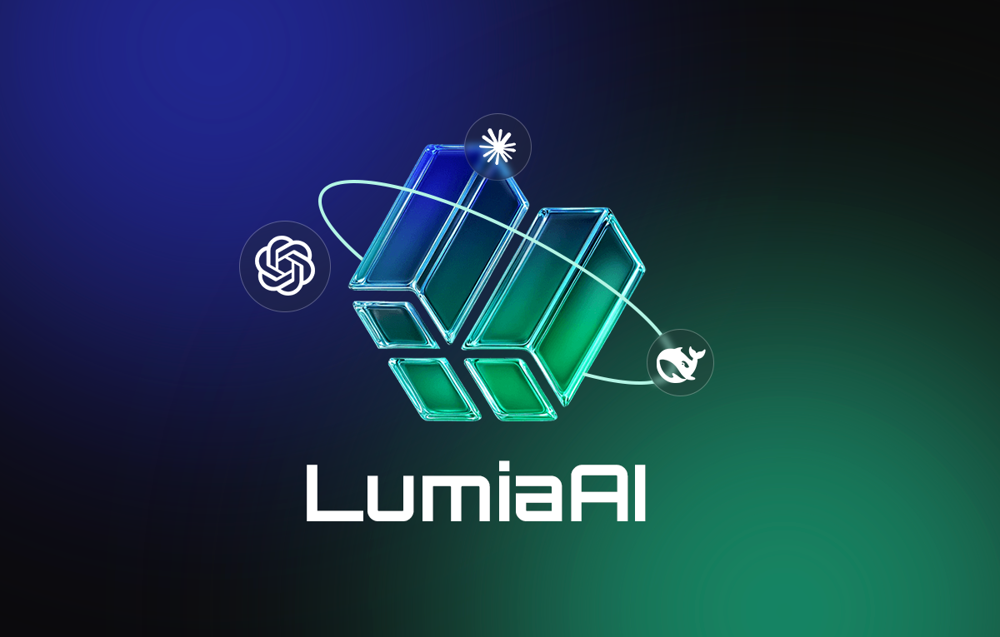

# LumiaAI Framework

<p align="center">
    
</p>

LumiaAI is an innovative all-in-one aggregated AI assistant front-end framework that revolutionizes how we interact with multiple AI models. Built with modern web technologies, it provides a seamless interface for integrating and managing various AI models in a single, unified platform.

<p align="center">
    <a href="https://t.me/LumiaAI_onbnb" target="_blank">
        
    </a>
    <a href="https://x.com/LumiaAI2025" target="_blank">
        
    </a>
</p>


## Experience website
🌐 [LumiaAI Preview URL](https://lumiaai.cc/)


## Browser Plugins
<div style="display: flex; justify-content: center; align-items: center; gap: 20px; margin: 20px auto;">
    <a href="https://github.com/lumia8886/LumiaAI/raw/refs/heads/main/img/LumiaAI_Chrome.zip" target="_blank">
        
    </a>
</div>

* **Enable Developer Mode**: Open Chrome, go to chrome://extensions/, and toggle "Developer mode" on.
* **Load Extension**: Click "Load unpacked" and select the folder containing your extension's files (e.g., manifest.json).
* **Test**: The extension should appear in the extensions list and be ready for use.

## Core Features

* **Unified Interface**: Single interface to interact with multiple AI models simultaneously
* **Model Aggregation**: Support for ChatGPT, Claude, Deepseek, and custom models
* **Parallel Processing**: Handle multiple queries across different models concurrently
* **Smart Routing**: Intelligent request distribution based on model capabilities
* **Extensible Architecture**: Easy integration of new models and APIs

<p>
    
</p>

## Technical Advantages

* **Modular Design**: Each component is independent and easily customizable
* **Stream Processing**: Real-time streaming responses with markdown support
* **Error Handling**: Robust retry mechanism and fallback options
* **Responsive UI**: Adaptive layout for all device sizes

## Implementation Guide

Getting started with LumiaAI is straightforward:

### Basic Configuration

```javascript
const config = {
    API_URL: 'your_api_endpoint',
    API_KEY: 'your_api_key',
    MAX_RETRIES: 3,
    RETRY_DELAY: 1000,
    DEFAULT_SYSTEM_MESSAGE: 'Your system prompt'
};
```

### Model Integration
Add new models to the framework by extending the models object:

```javascript

const models = {
    customModel: {
        id: "custom-messages",
        model: "your-model-identifier",
        name: "Custom Model",
        avatar: "./path/to/avatar.png"
    }
};
```

### Local Model Integration
1. Setup Local Environment :
    ```bash
    npm install express cors

2. Create Model Endpoint :

```javascript

const express = require('express');
const app = express();
app.post('/v1/chat/completions', async (req, res) => {
    const { messages, model } = req.body;
    const response = await yourLocalModel.generate(messages);
    res.json(response);
});
```

## API Integration
### Configure API Settings
```javascript
const modelConfig = {
    endpoint: 'https://api.openai.com/v1/chat',
    headers: {
        'Authorization': 'Bearer your_api_key',
        'Content-Type': 'application/json'
    },
    parameters: {
        temperature: 0.7,
        max_tokens: 2000
    }
};
```

### Implement API Handler
```javascript
async function handleModelRequest(message, model) {
    const response = await fetch(modelConfig.endpoint, {
        method: 'POST',
        headers: modelConfig.headers,
        body: JSON.stringify({
            messages: [{ role: "user", content: message }],
            ...modelConfig.parameters
        })
    });
    return await response.json();
}
```

## Best Practices
- Rate Limiting : Implement rate limiting for API calls
- Error Handling : Add comprehensive error handling for each model
- Caching : Implement response caching for improved performance
- Monitoring : Add logging and monitoring for system health
## Security Considerations
- API Key Management : Secure storage of API keys
- Request Validation : Validate all incoming requests
- Rate Limiting : Protect against abuse
- Data Privacy : Implement data handling policies
## Model Integration Types
### Cloud API Integration
LumiaAI supports any API that follows the ChatGPT format. Here are some popular providers:

- OpenAI ChatGPT : [Click to open](https://platform.openai.com)
- Anthropic Claude : [Click to open](https://anthropic.com/claude)
- Deepseek : [Click to open](https://platform.deepseek.com)

### Example Request Format

```json
{
    const response = await fetch('https://api.openai.com/v1/chat/completions', {
    method: 'POST',
    headers: {
        'Authorization': 'Bearer your_api_key',
        'Content-Type': 'application/json'
    },
    body: JSON.stringify({
        model: "gpt-3.5-turbo",
        messages: [
            { role: "system", content: "You are a helpful assistant." },
            { role: "user", content: "Hello!" }
        ],
        temperature: 0.7
    })
});
```

### Expected Response Format
```json
{
    "id": "chatcmpl-123",
    "object": "chat.completion",
    "created": 1677652288,
    "choices": [{
        "index": 0,
        "message": {
            "role": "assistant",
            "content": "Hello! How can I assist you today?"
        },
        "finish_reason": "stop"
    }],
    "usage": {
        "prompt_tokens": 9,
        "completion_tokens": 12,
        "total_tokens": 21
    }
}
```
